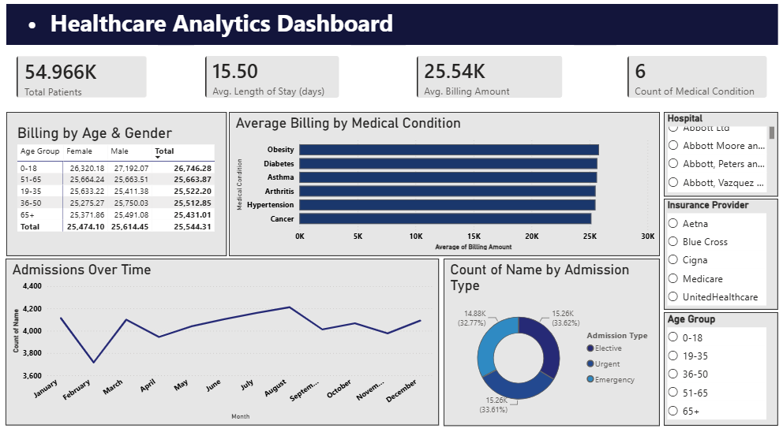

# Healthcare Analytics Dashboard

Cleaned and analyzed patient billing, admissions, and hospital trends across 54,000+ patient records using Excel, then built an interactive Power BI dashboard to visualize the findings.

## Tools Used
Excel (data cleaning, calculated fields), Power BI (interactive dashboard)

## Key Insights
- The 0-18 age group had ~5% higher average billing than other age groups
- Admission types were evenly split (~33% each across Emergency, Elective, and Urgent)
- Obesity and Cancer showed the highest average billing among medical conditions

## Dataset
[Healthcare Dataset by Prasad Patil (Kaggle)](https://www.kaggle.com/datasets/prasad22/healthcare-dataset)
